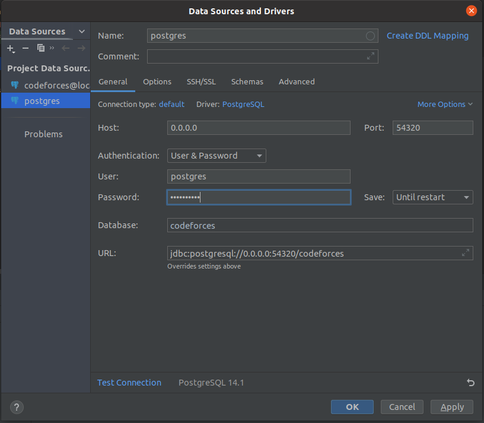

# Competitive programming site


# client_side
1️⃣ Each folder in this directory indicates problem id and contains solutions for the corresponding problem.

# cmd
2️⃣ Contains: 
 - main.go - entry point of the program
 - 2 go and exe files (participant_solution.go / participant_solution.exe and main_solution.go / main_solution.exe)
 - makefile that builds binaries for the participant_solution.go and main_solution.go

# internal
3️⃣ Server and the logic of handling requests.

# temp_solutions
4️⃣ Storage of users' solution files.

# web
5️⃣ The frontend part (templates and css). 

<br />

### To run project enter following commands from the root of the project:
```bash
cd deployments/kafka
docker-compose up
```

# Migrations
### Copy content of **db/migrations/init.db.sql**

### Open DataGrip, configure DSN as following (password adminadmin):
<p>
    
</p>

### Run sql commands with newly created session
***

# API
- WITHOUT AUTHENTICATION:

        localhost:8080/users
        localhost:8080/problemset
        localhost:8080/sessions?email=user_email&password=user_password

- WITH AUTHENTICATION:

        localhost:8080/profile
        localhost:8080/contests
        localhost:8080/contests/1
        localhost:8080/contests/1/submissions
        localhost:8080/contests/1/problems
        localhost:8080/contests/1/problems/1
***
### Open html page in web browser **web/template/index.html**

***

# Upload solution: 
    for problem A (client_side/solutions/0001/solution.go) 
    for problem B (client_side/solutions/0002/solution.go) 

[Report](https://github.com/Kambar-ZH/Golang_Midterm_Project/blob/master/Report.pdf)

